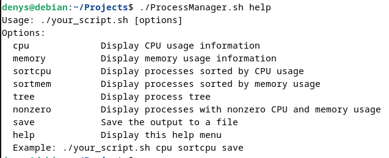
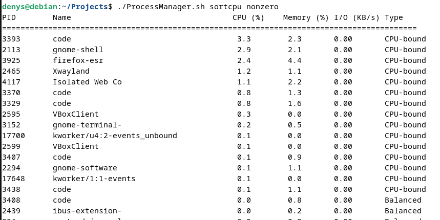

# Process Manager 

A simple script that runs in the terminal and identifies the processes which are currently running on your machine. For every process, the script also provides the CPU and memory usage, categorizing them as either **CPU-bounded** or **Memory-bounded**.

In addition, the script has a few options that change the output, giving the user a few different ways of utilizing it. Some of the said commands include a way of sorting the processes based on the CPU or memory usage (**sortcpu** / **sortmem**), showing only the CPU or memory usage (**cpu** / **mem**) or saving the output in a text file called "output_*Date&TimeOftheScan*" (**save**). The list with all the options available can be accessed using the "help" command.

## Commands implemented

* **cpu** - Displays the CPU usage
* **mem** - Displays the Memory usage
* **sortcpu** - Displays processes sorted by the CPU usage in decreasing order.
* **sortmem** - Displays processes sorted by the Memory usage in decreasing order.
* **tree** - Displays processes in a tree structure.
* **nonzero** - Displays only the processes with CPU and Memory usage greater than 0.
* **save** - Saves the output in a text file called "output_*Date&TimeOftheScan*".
* **help** - Displays the list of commands.

## Example Use

